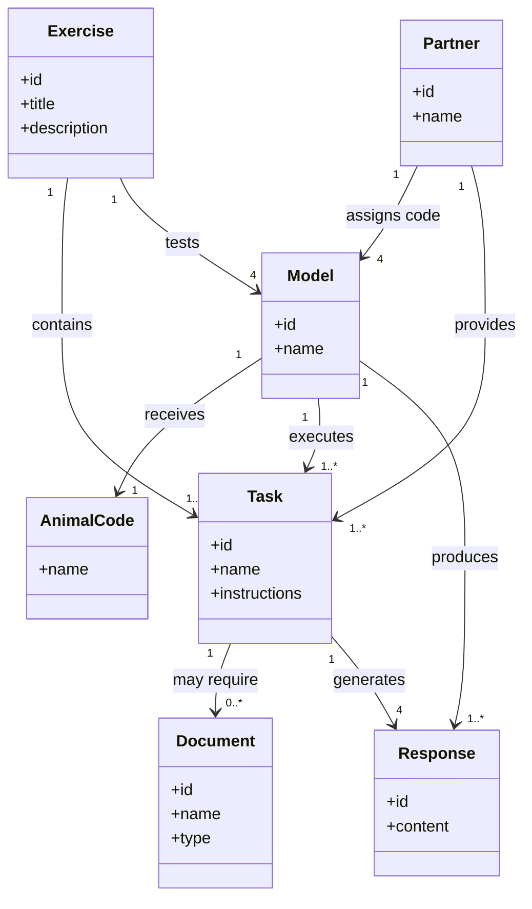

```mermaid
classDiagram
    class Exercise {
        +id
        +title
        +description
    }

    class Partner {
        +id
        +name
    }

    class Model {
        +id
        +name
    }

    class AnimalCode {
        +name
    }

    class Task {
        +id
        +name
        +instructions
    }

    class Document {
        +id
        +name
        +type
    }

    class Response {
        +id
        +content
    }

    Exercise "1" --> "1..*" Task : contains
    Exercise "1" --> "4" Model : tests

    Partner "1" --> "4" Model : assigns code
    Partner "1" --> "1..*" Task : provides

    Model "1" --> "1" AnimalCode : receives
    Model "1" --> "1..*" Task : executes
    Model "1" --> "1..*" Response : produces

    Task "1" --> "0..*" Document : may require
    Task "1" --> "4" Response : generates
```
